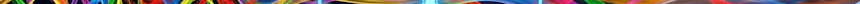

> [!TIP] 
> 🦅
> This package is part of the [Eegle.jl](https://github.com/Marco-Congedo/Eegle.jl) ecosystem for EEG data analysis and classification

---

# Gedai

A pure-[julia](https://julialang.org/) package implementing the **GEDAI** denoising method for EEG data.

**GEDAI** performs generalized eigenvalue-eigenvector decompositions (GEVD) of sliding-windows data covariance matrices and a fixed model covariance matrix obtained from a standard leadfield used in EEG inverse solutions. It defines a new criterion to define a rejection region for the artifact components, yielding a **SENSAI** score for the denoising performance (the higher, the better).

The method has the advantage of being fast and of performing well in general with default settings, provided that:
- the electrodes cover the scalp homogeneously
- a sufficient number of electrodes is used.

> [!WARNING] 
> No artifact correction based on spatial decompositions method can be perfect. Depending on the data and on the method, a portion of genuine EEG signals will be removed as well. The critical question to judge on an artifact correction algorithm is therefore its *sensitivity* and *specificity*. Please visit the [GEDAI website](https://neurotuning.github.io/gedai/dev/index.html) and read the associated paper given in the [references](#-references) for more information.

> [!TIP] 
> By default, **GEDAI** adopts the full-rank pseudo common average reference — see [here](https://marco-congedo.github.io/Eegle.jl/stable/Processing/#Eegle.Processing.car!), which preserves the rank of the input data, but cannot be reverted after denoising. While this is preferable in general, **Gedai.jl** allows to work also in the original electrical reference if needed— see the last [example](#-examples).



## 🧭 Index

- 📦 [Installation](#-installation)
- 💡 [Examples](#-examples)
- 🔌 [API](#-api)
- ✍️ [About the Authors](#️-about-the-authors)
- 🌱 [Contribute](#-contribute)
- 🎓 [References](#-references)
- ⚖️ [License](#-license)


## 📦 Installation

*julia* version 1.10+ is required.

Execute the following command in julia's REPL:

```julia
]add https://github.com/Marco-Congedo/Gedai, EEGPlot, GLMakie
```

[▲ index](#-index)


## 💡 Examples
Run the following code (automatic artifact correction):

```julia
using Gedai, EEGPlot, GLMakie

example_data = "CAUEEG";
data, srate, labels = read_example_data(example_data);

clean, data_ref, score, t = denoise(data, srate, labels);

eegplot(clean, srate, labels; 
        overlay=data_ref, 
        Y=data_ref-clean,
        overlay_color = :burlywood, 
        Y_color=:sienna2
        )
```

You will be able to inspect the data, the removed artifacts and the cleaned data. Click [here](https://github.com/Marco-Congedo/EEGPlot.jl/blob/master/docs/src/assets/GDEAI_small.gif) for a quick preview of what you will see once the code has executed. For more options on visualizations, see [EEGPlot](https://github.com/Marco-Congedo/EEGPlot.jl).

The package provides several example files. Any of the following can be used in the demo above: 

"CAUEEG", "artifact_jumps", "empirical_NOISE_EOG_EMG", "synthetic_bad_channels", "blinks and bad channels".

> [!TIP]
> If you need to denoise several files with the same electrode montage (the `labels`), 
> for example all recordings of an experiment, you can gain time by doing some pre-computations:

```julia
# Supposing that `data` is a vector of EEG recordings and supposing that
# `sr` and `labels` are the sampling rate and electrode labels, common to all recordings,
cleans = similar(data); # memory to store the corresponding cleaned recordings
refCOV = refcov(labels, 0.05); # precompute model covariance matrix
precomp = precompute(refCOV, :cholesky); # precompute GEVD matrices
@threads for (d, datum) in enumerate(data) # multi-threading across files and reuse pre-computations
            cleans[d], rest = denoise(datum, sr, labels; threaded=false, refCOV, precomp);
end
# `cleans` is now a vector holding the clean EEG recordings corresponding to `data`
```

> [!TIP]
> If you need to preserve the original electrical reference of the data, you can pre-compute a model covariance matrix with the same reference using package [Leadfields.jl](https://github.com/Marco-Congedo/Leadfields.jl). For doing so, however, the reference must be a single lead (e.g., linked ears is not allowed) and must be comprised in this [list](Documents/sensors343.txt). For example, if the electrical reference is the right ear-lobe (A2):

```julia
# Supposing that `X` is an EEG recording referenced to the right ear-lobe,
# `sr` is its sampling rate and `labels` its electrode labels,
using Gedai, Leadfields, Statsbase

# compute leadfield
K, ename, eloc, gridloc = leadfield(labels; reference = "A2")

# compute and regularize (lambda) the model covariance matrix of the leadfield referenced to A2
lambda = 0.05
refCOV = refcov(labels, "A2", lambda)

clean, data_ref, score, t = denoise(X, sr, labels; car = false, refCOV, lambda);

# Note that:
# - argument `car` is set to false to prevent re-referencing the data to the pseudo common average
# - argument `refCOV` is passed for overriding the default model covariance matrix
# - argument `lambda` is passed to `denoise` to match the regularization of the model covariance matrix
```

[▲ index](#-index)


## 🔌 API

The package exports the following functions:

| Function | Description |
|:---------|:---------|
| [denoise](#denoise)   | main function. GEDAI denoising  |
| [read_example_data](#read_example_data)  | read example data for demos |
| [refcov](#refcov)  | load the model matrix used by GEDAI for a given electrode montage and regularize it |
| [precompute](#precompute)  | precompute matrices that are used repeatedly |

[▲ index](#-index)


### denoise

```julia
function denoise(# arguments:
                eeg_data   ::Matrix{T}, 
                sr          ::Union{Float64, Int}, 
                labels      ::Vector{String};
                # optional keyword arguments:
                wavelet_levels  ::Int                           = 9,
                high_pass       ::Union{Real, Nothing}          = 0.5,
                gevd_method     ::Symbol                        = :cholesky
                refCOV          ::Union{SymOrHerm, Nothing}     = nothing,
                precomp         ::Union{Chols, Whits, Nothing}  = nothing,
                threshold       ::Float64                       = 1.0,
                car             ::Bool                          = true,
                threaded        ::Bool                          = true,
                BLAS_threaded   ::Bool                          = true,
                verbose         ::Bool                          = true
                lambda          ::Float64                       = 0.05,
                epoch_length    ::Float64                       = 1.0,
                top_PCs         ::Int                           = 3, 
                cov_mean_type   ::Union{Int, Nothing}           = nothing, # or `0` 
                brent_tol       ::Float64                       = 0.01,
                t_range         ::Tuple{Float64, Float64}       = (0.0, 12.0)
                ) where T<:Real

```


**Arguments:**
- `data`: an EEG data matrix of any Real type and dimension `TxN`, where `T` is the number of channels and `N` the number of samples,
- `sr`: the sampling rate of the data. It can be an Integer or a Real type,
- `labels`: a vector of String types holding the sensor labels (e.g., "FP1", "FP2",...). 
> [!WARNING] 
> Each label must match one of the strings in this [list](Documents/sensors343.txt) (case-insensitive matching).

**Optional Keyword Arguments:**
- `wavelet_levels`: a positive integer, default = `9`. If >1, run the **wavelet-based** GEDAI with this number of bands, otherwise run the **broadband** version of GEDAI,
- `high-pass`: a positive real number, default = `0.5`. if it is not `nothing`, submit the data to a fourth-order linear phase response
    (forward-backward) high-pass filter with cut-off at this value (Hz),
- `gevd_method`: a symbol, the generalized eigenvector-eigenvalues (GEVD) methods (default = :cholesky). Possible values are :
    - `:gevd`: standard GEVD
    - `:cholesky`: 2-step GEVD with whitening by the inverse of the Cholesky factor
    - `:invsqrt`: 2-step GEVD with whitening by the inverse of the principal square root,
- `refCOV`: Default = `nothing`. Can be a `Symmetric` or `Hermitian` matrix holding the model covariance matrix (pre-computed for hastening computations),

> [!NOTE]
> For precomputing the model covariance matrix, see [refcov](#refcov)

- `precomp`: default = `nothing`, can hold pre-computed matrices to hasten computations:
    - if `gevd_method=:cholesky` : a 2-tuple holding the Cholesky factor of refCOV and its inverse transpose
    - if `gevd_method=:invsqrt` : a 2-tuple holding the principal square root of refCOV and its inverse

> [!NOTE]
> For precomputing these matrices, see [precompute](#precompute)

- `threshold`: a positive real number, the threshold for artifact correction used in SENSAI. Default = `1.0`. This can be used for fine-tuning the rejection region; with a threshold <1 the artifact rejection will be more aggressive, but the probability to reject genuine EEG signal increases as well. Conversely for a threshold >1,

- `car`: if `true` (default), re-reference the input data to the pseudo common average. This is set to false if a custom model covariance matrix is pre-computed for preserving the original reference of the data — see the last [example](#-examples),
- `threaded`: if `true` (default), run in multi-threading mode. Refer to julia documentation for learning how to set the number of threads to be used,
- `BLAS_threaded`: if `true` (default), run BLAS operations (for linear algebra) in multi-threading mode,
- `verbose`: if `true` (default), print information while running the algorithm.

The behavior of GEDAI can be further tuned using the following optional keyword arguments. Change them only if you know what you are doing :

- `lambda`: a positive real number, the amount of regularization of the model covariance matrix. Deafult = `0.05`
- `epoch_length`: a positive real number, the length of the sliding window, in seconds, used by GEDAI. Deafult = `1.0`
- `top_PCs`: a positive integer < `N` the number of the generalized principal components used by the SENSAI algorithm. Deafult = `3`
- `cov_mean_type`: if `nothing` (default), subtracts the mean vector when computing covariance matrices. If `0`, do not
- `brent_tol`: a real number used to find the local minimum of a function using Brent's method (for SENSAI). Deafult = `0.01`
- `t_range`: a Tuple{Float64, Float64} delimiting the acceptance region for eigenvalues. Default = (0.0, 12.0).

**Return:**

The 4-tuple holding:
- an EEG data matrix of the same size as `data`, holding the denoised data,
- the original data.
- the SENSAI score (the higher, the better),
- the execution time in seconds.

The first two returned elements are data matrices. They are referenced to the full-rank pseudo-common average (the common average reference with correction = 1 as explained [here](https://marco-congedo.github.io/Eegle.jl/stable/Processing/#Eegle.Processing.car!)) if `car` is true (default)
and high-pass filtered if `high-pass` is not `nothing` (default = 0.5(Hz)). 

> [!TIP] 
> The removed artifacts are obtained subtracting the first returned element (the denoised data, possibly re-referenced and high-pass filtered) from the second (the input data, possibly re-referenced and high-pass filtered). Always use the second element and not the input data for computing the removed artifacts.

See [Examples](#-examples) for usage.

> [!TIP] 
> Please note that *Julia* is a compiled language; the first time you run the function it will be compiled. From the second time on, it will execute fast.

[▲ API index](#-api)

[▲ index](#-index)

---

### read_example_data

```julia
function read_example_data(name::String; verbose = true)
```

Read one one of the provided example files with `name` any of the following :
- "CAUEEG" 
- "artifact_jumps" 
- "empirical_NOISE_EOG_EMG" 
- "synthetic_bad_channels" 
- "blinks and bad channels".

If `verbose` is true, print information while reading the file

See [Examples](#-examples) for usage.

[▲ API index](#-api)

[▲ index](#-index)

---

### refcov

```julia
(1) function refcov(labels::Vector{String}, lambda::Float64= 0.05)

(2) function refcov(labels::Vector{String}, reference::String, lambda::Float64= 0.05;
                    cov_mean_type::Union{Int, Nothing} = nothing)
```

**Method (1)**

Load the default model covariance matrix used by GEDAI for a given electrode montage given by the vector of electrode labels `labels` 
and regularize it by amount `lambda`.

**Method (2)**

As in (1), but the model covariance matrix is computed from the leadfield referenced to the `reference` electrode. This can be used to perform GEDAI denoising in the original electrical reference of the data.

> [!WARNING] 
> All electrode labels (both in `labels` and `reference`) must match one of the strings in this [list](Documents/sensors343.txt) (provided in the 'Documents' directory of this repository).

See [Examples](#-examples) for usage.

[▲ API index](#-api)

[▲ index](#-index)

---

### precompute

```julia
function precompute(refCOV::SymOrHerm, gevd_method::Symbol; warning::Bool = true)
```
Precompute matrices that are used repeatedly. This is useful when several recordings with the same electrode montage 
are to be denoised.

`refCOV` is the model covariance matrix to be used by the GEDAI algorithm. It is to be computed by function [refcov](#refcov).

`gevd_method` is the generalized eigenvector-eigenvalue decomposition (GEVD) method to be used when calling the [denoise](#denoise) function.
Therefore, it must match the `gevd_method` passed to that function (for which the default is `:cholesky`).
It can be:
- `:cholesky` : generate a 2-tuple holding the Cholesky factor of `refCOV` and its inverse transpose
- `:invsqrt` : generate a 2-tuple holding the principal square root of `refCOV` and its inverse

If `warning` is `true`, print a warning if `gevd_method=:gevd` has been passed, reminding that it is useless to do pre-computations in this case 
as the GEVD method does not make use of precomputed matrices.

See [Examples](#-examples) for usage.

[▲ API index](#-api)

[▲ index](#-index)


## ✍️ [About the Authors](#️-about-the-authors)

[Marco Congedo](https://github.com/Marco-Congedo) and [Tomas Ros](https://github.com/neurotuning-personal)

[▲ index](#-index)


## 🌱 [Contribute](#-contribute)

Please contact the authors if you are interested in contributing.

[▲ index](#-index)


## 🎓 [References](#-references)

Ros T, Férat V., Huang Y., Colangelo C., Kia S.M., Wolfers T., Vulliemoz S., & Michela A. 
*Return of the GEDAI: Unsupervised EEG Denoising based on Leadfield Filtering* (2025)  [bioRxiv]. [[DOI/Link to paper](https://www.biorxiv.org/content/10.1101/2025.10.04.680449v1)]  

**To cite this Repo:**

Congedo M, Ros T (2026) *A Julia package for automatic artifact correction of EEG data*, GitHub repository

[▲ index](#-index)


## ⚖️ License
You may use this software under the terms of the PolyForm Noncommercial License 1.0.0 [LICENSE](LICENSE). This is suitable for personal use, research, or evaluation.

**Commercial License**  
If you wish to use this software in a commercial or proprietary application without being bound by terms of the PolyForm Noncommercial License 1.0.0, you must purchase a commercial license. The core algorithms in this repository are the subject of a pending patent application, and a commercial license includes a grant for patent rights.  


[▲ index](#-index)
